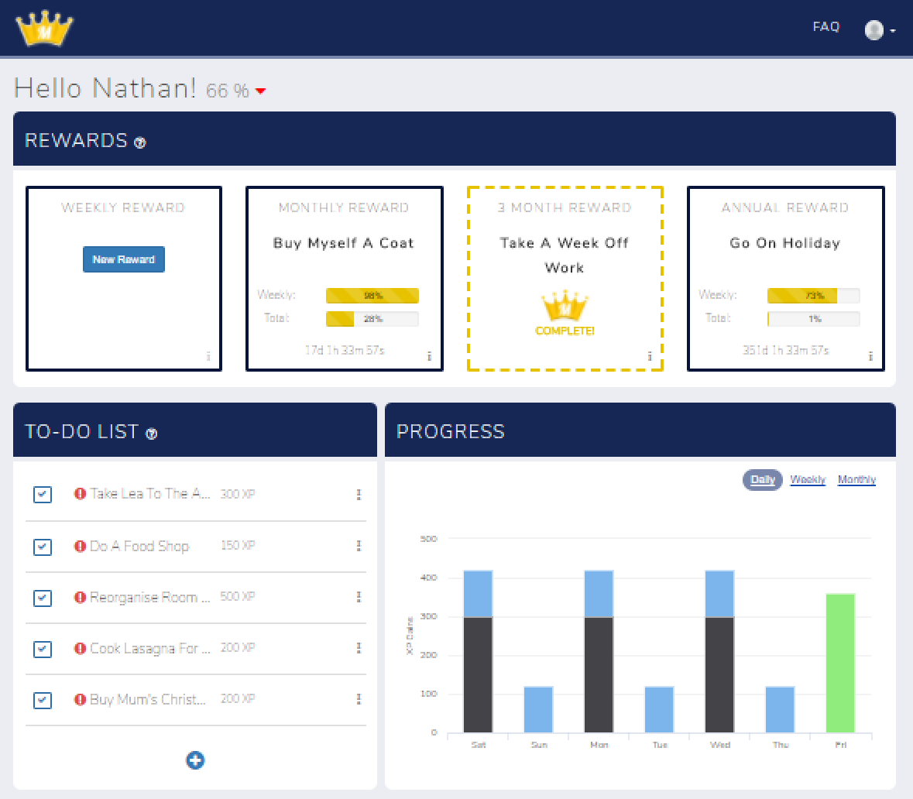

# TrackMyGoals

TrackMyGoals - A mobile responsive website for tracking your goals and tasks and reviewing your progress.

This productivity web app has a dashboard and follows the skinny controller, fat model approach. 

Users log their personal goals and are awarded bonus XP when on a streak of 5 days/weeks/months or more. The period is selected by the user when creating the goal.

### Built with:
* Ruby 2.3.0
* Rails 5
* HTML5
* JSON
* CSS/SASS
* Bootstrap
* Google JS API
* Cloud9 IDE (Linux)

### Features include:
* Google charts JS library for data visualisation in dashboard. See app/views/goals/dashboard.html.erb (Data aggregated in app/controllers/user_controller.rb, line 19 - line 91)
* Methods in goal.rb to check if user is on a streak and calculate the length of the streak. See app/models/goal.rb
* Users are awarded more XP for completing tasks while on a streak. See app/models/goal.rb
* Dynamic form on page for entering quantities for goals. See app/views/goals/show.html.erb

### Problems solved:
* Iterating through activities to see how many days in a row the user has logged activities for each goal.
* Creating a stacked column chart using JSON data and multi dimensional arrays.
* Don't Repeat Yourself - As the model file for goal started to grow, I refactored the code to create methods which checked conditions once and returned the appropriate value.
* Optimization - Initially stored xp values in the table but this slowed the site down as it needed to check the DB mutliple times. Instead, I created methods that calculate the xp values based on certain conditions.
* Daily goal streaks would end as a new day started so users would lose their bonus streak. I added a condition which excluded the current period.